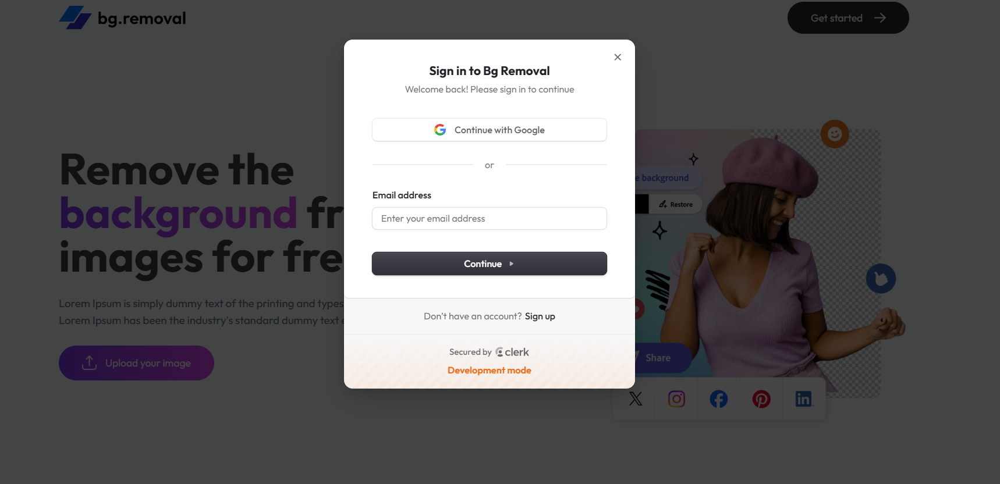

AI Background Removal SaaS Application

Project Summary
Built a full-stack AI SaaS application that removes image backgrounds and provides transparent image downloads. Designed with real-world SaaS architecture, including authentication, credit management, and online payments. Focused on scalability, security, and production-readiness.

Key Features
AI-powered image background removal
Upload images and download transparent PNG outputs
Credit-based usage system to control AI operations
Online payment integration for purchasing credits
Secure user authentication and profile management
Responsive and modern user interface

Tech Stack
Frontend
React.js
Tailwind CSS
Clerk Authentication (UI + session management)

Backend
Node.js
Express.js
Database
MongoDB (user data, credits, transactions)

AI Integration
AI-based image background removal service

Payments
Online payment gateway integration
Authentication & Security
Implemented Clerk authentication for login, registration, and user management.
Used Clerk’s pre-built UI components to reduce boilerplate and improve UX.

Secured API routes and validated user sessions on the backend.
Credit & Monetization System
Each background removal consumes one credit.
New users receive free starter credits.
Users can purchase additional credits via online payments.
Credits are tracked and validated on every AI request.

Backend Responsibilities: 
RESTful API development using Express.js\
AI service request handling and response processing
Credit deduction and validation logic
Payment verification and transaction handling
MongoDB integration for persistent storage

Frontend Responsibilities:
Image upload and preview functionality
User authentication flow integration
Credit status display and usage feedback
Clean, responsive UI built with Tailwind CSS

Application Workflow:
User signs up or logs in
Uploads an image
AI removes the background
Credit is deducted
Processed image is available for download

